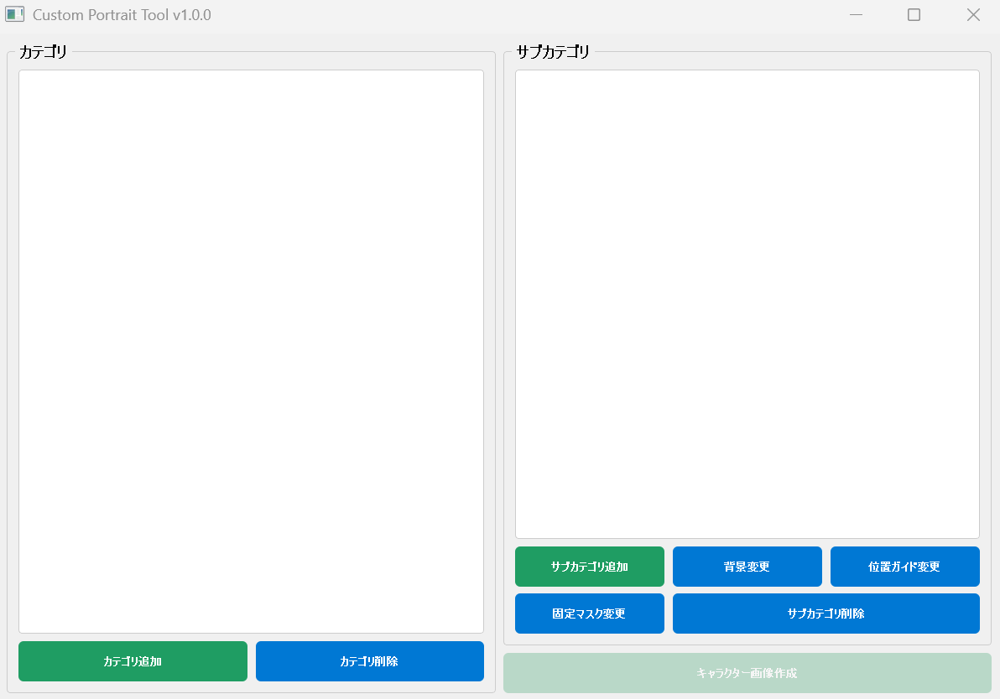
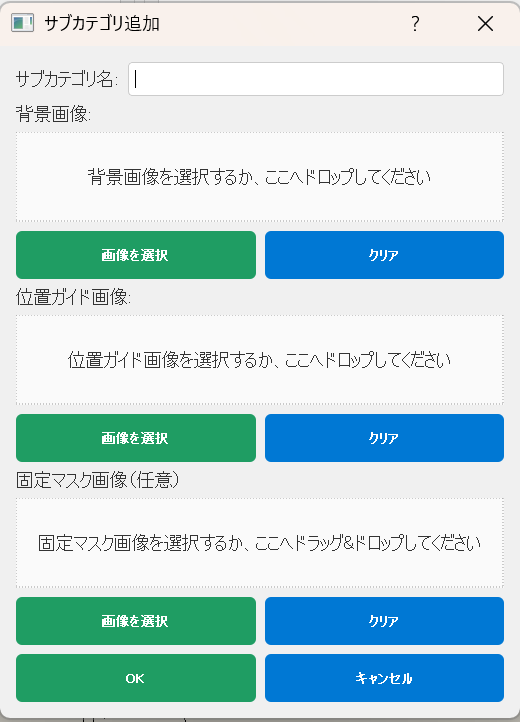
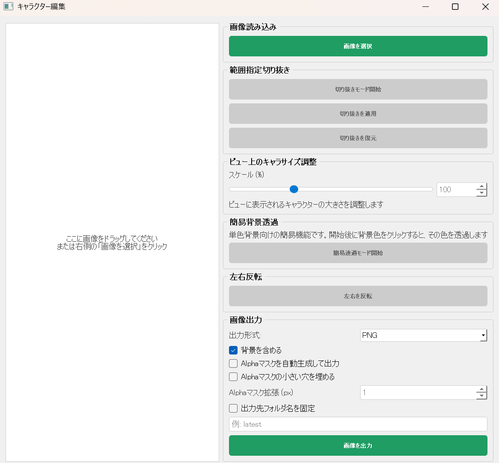
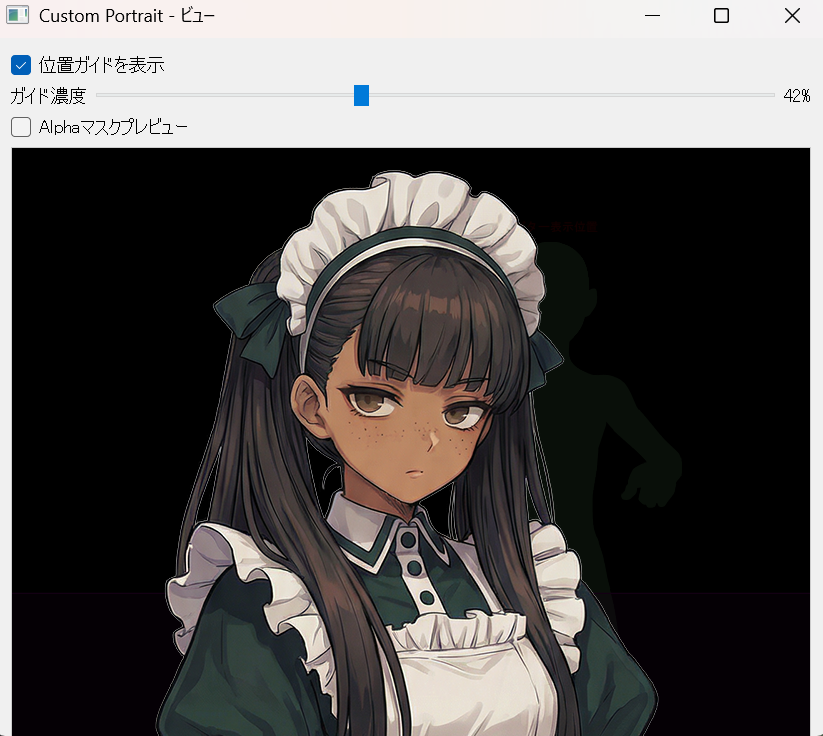
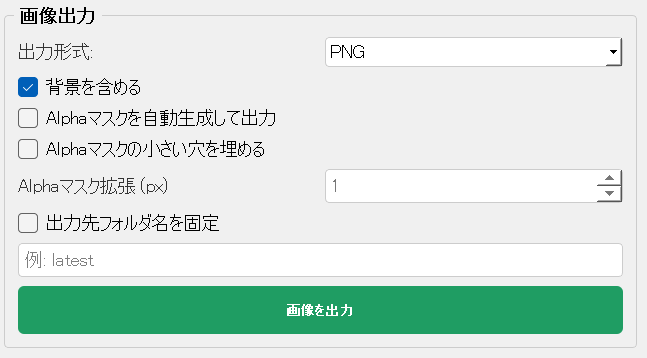

# Custom Portrait Tool

ゲーム用のカスタムポートレート作成ツール

現在の配布版: `v1.0.0`

## ダウンロード

- 普通に使うだけなら、GitHub Releases から `CustomPortraitTool.exe` をダウンロードして起動するのがおすすめです
- Releases ページ: `https://github.com/miyaya55/customportraits/releases`
- ソースコードを編集したい人や、自分で exe を作りたい人だけ、下の `ソースコードから使う場合` を参照してください

## exe 版の使い方

1. GitHub Releases から `CustomPortraitTool.exe` をダウンロードします
2. 任意のフォルダに配置します
3. `CustomPortraitTool.exe` をダブルクリックして起動します

- 初回起動時は Windows の警告が出る場合があります
- 出力画像や設定ファイルは、実行したフォルダを基準に作成されます
- 配布相手が Python に詳しくない場合は、exe 版の利用をおすすめします

## README に画像を載せる方法

- 画像は `docs/images/` フォルダに入れておくと整理しやすいです
- README では、次のように書くと画像を表示できます

```md

```

- 見出し付きで並べたい場合は、次のように書けます

```md
### メイン画面

```

- ファイル名は半角英数字とハイフン区切りにしておくと扱いやすいです
- 例: `main-window.png`, `editor-window.png`, `viewer-window.png`

## リリース情報

- 初回公開版のバージョン番号は `v1.0.0` です
- GitHub Releases のタイトルは `v1.0.0` 形式をおすすめします
- Release 本文のたたき台は [`RELEASE_NOTES_v1.0.0.md`](RELEASE_NOTES_v1.0.0.md) をそのまま使えます
- Releases への載せ方は [`RELEASE_GUIDE.md`](RELEASE_GUIDE.md) にまとめています

## 概要

このツールは、ゲーム用のカスタムポートレート（キャラクター画像）を作成・編集するための Windows デスクトップアプリケーションです。

## 機能

### カテゴリ・サブカテゴリ管理
- カテゴリ（ゲーム名）の登録
- サブカテゴリ（使用シーン）の登録と背景画像設定
- 既存サブカテゴリの背景画像変更
- 既存カテゴリ・サブカテゴリの削除機能

### キャラクター編集
- 複数の画像編集ツール
  - **範囲指定切り抜き** - マウスドラッグで自由に選択
  - **拡大・縮小** - スライダーまたは直接数値入力（10%～300%）
  - **簡易背景透過** - 単色背景をクリック選択して簡易的に透過
  - **左右反転** - キャラクター画像を左右反転

### ビュー画面
- サブカテゴリごとの背景画像表示
- 位置ガイド画像の薄表示切り替え
- Alphaマスクプレビュー表示
- キャラクター画像合成表示
- ドラッグでキャラクターの位置調整
- 編集内容の即座反映

### ポートレート出力
- 出力形式: PNG または BMP（キャラクター編集画面で選択）
- 背景の有無: チェックボックスで選択
  - 背景あり: 背景+キャラクターの合成画像
  - 背景なし: キャラクター画像のみ
- 自動連番管理
- 固定フォルダ名への出力
- Alphaマスク画像の自動生成
- 出力ディレクトリ構造: `customportrait/[カテゴリ]/[サブカテゴリ]/[連番]/`

### ドラッグ&ドロップ対応
- 背景画像選択ダイアログ
- キャラクター画像選択ダイアログ
- キャンバス上へのドロップによる直接読み込み

## ソースコードから使う場合

### 必要な環境
- Python 3.10 以上
- Windows OS

#### 推奨動作環境

- OS: `Windows 10 / 11 64bit`
- CPU: 一般的なデスクトップ / ノート PC 向け CPU
- メモリ: `8GB 以上推奨`
- 空き容量: `500MB 以上推奨`
- 画面解像度: `1280x720 以上推奨`

#### 最低限の目安

- OS: `Windows 10 64bit`
- メモリ: `4GB`
- 空き容量: `300MB 程度`

#### 非推奨 / 非対応

- `Windows 7 / 8 / 8.1`: 非推奨
- `32bit Windows`: 非対応想定
- `Windows XP / Vista 以前`: 非対応
- 書き込み権限のない場所での実行: 非推奨

#### 補足

- 縦長画像や透過 PNG を扱うため、メモリが少ない環境では動作が重くなる場合があります
- GPU は必須ではありません

### セットアップ

1. プロジェクトフォルダに移動
```bash
cd C:\path\to\customport
```

- プロジェクトフォルダは好きな場所に作成して問題ありません
- 以降のコマンドは、このプロジェクトを置いたフォルダで実行してください

2. 依存パッケージをインストール
```bash
pip install -r requirements.txt
```

## 使用方法

### まず使う場合

- 一般的な利用なら `CustomPortraitTool.exe` を起動してください
- Python 環境を使うのは、ソースコードを編集したい場合や、自分で exe を再ビルドしたい場合です

### 画像付き操作手順テンプレート

- README に画面キャプチャを入れるなら、次の流れで並べると分かりやすいです
- 下の画像リンクは、`docs/images/` に画像を置いたあとで有効になります

#### 1. メイン画面

カテゴリとサブカテゴリを選んで、作業する場面を決めます。

```md

```

#### 2. サブカテゴリ設定

背景画像、位置ガイド画像、固定マスク画像を必要に応じて設定します。

```md

```

#### 3. キャラクター画像作成

キャラクター画像を読み込み、切り抜きや拡大縮小、簡易背景透過、左右反転などを行います。

```md

```

#### 4. ビュー確認

ビュー画面でキャラクター位置を調整し、位置ガイドや Alpha マスクの見え方を確認します。

```md

```

#### 5. 出力

出力形式や背景の有無を選び、画像を保存します。

```md

```

### アプリケーション起動
```bash
# 方法1: ランチャースクリプトを使用（推奨）
python run.py

# 方法2: モジュールとして実行
python -m src.main

# 方法3: 直接スクリプトを実行（要・プロジェクトルート移動）
cd C:\path\to\customport
python src/main.py
```

### 基本的な操作フロー

1. **カテゴリを作成**
   - メイン画面の「カテゴリ追加」をクリック
   - カテゴリ名（ゲーム名）を入力

2. **サブカテゴリを作成**
   - カテゴリを選択
   - 「サブカテゴリ追加」をクリック
   - サブカテゴリ名を入力して背景画像を選択

3. **キャラクター画像を作成**
   - カテゴリとサブカテゴリを選択
   - 「キャラクター画像作成」をクリック
   - 編集ウィンドウでキャラクター画像を加工

4. **ポートレートを出力**
   - 編集ウィンドウで出力形式を選択（PNG/BMP）
   - 背景の有無をチェック
   - 「画像を出力」をクリック
   - `customportrait/` フォルダに自動保存

## 操作ガイド

### キャラクター編集ウィンドウ

#### 範囲指定切り抜き
1. 「切り抜きモード開始」をクリック
2. マウスを左クリックしてドラッグで範囲選択
3. 「切り抜きを適用」をクリック

#### 拡大・縮小
1. スライダーを移動 または スピンボックスに数値入力
2. 変更した時点でビューへ反映

#### 簡易背景透過
1. 「簡易透過モード開始」をクリック
2. 画像上の単色背景をクリック
3. クリックした時点で簡易透過してビューへ反映
4. きれいに抜けない場合は、透過済みPNGを別途用意して読み込むのを推奨

#### 左右反転
- 「左右を反転」をクリック

### ビュー画面

#### キャラクター配置
- キャラクター画像をクリック・ドラッグして位置調整

## ファイル構成

```
[任意の作業フォルダ]/
└── customport/
├── src/
│   ├── main.py                  - エントリーポイント
│   ├── core/
│   │   ├── config.py            - 設定・データベース管理
│   │   ├── image_processor.py   - 画像処理機能
│   │   └── file_manager.py      - ファイル操作・出力管理
│   ├── ui/
│   │   ├── main_window.py       - メイン画面
│   │   ├── editor_window.py     - キャラクター編集画面
│   │   ├── viewer_window.py     - ビュー・プレビュー画面
│   │   └── styles.py            - UI スタイル定義
│   └── utils/
│       └── constants.py         - アプリケーション定数
├── data/
│   ├── config.json              - ユーザー設定（自動生成）
│   └── portraiture.json         - ポートレートDB（自動生成）
├── customportrait/              - 出力フォルダ（自動生成）
└── requirements.txt             - Python依存パッケージ
```

## データ構造

### portraiture.json
```json
{
  "categories": [
    {
      "name": "Game Name",
      "subcategories": [
        {
          "name": "Scene Name",
          "background": "/path/to/background.png",
          "characters": []
        }
      ]
    }
  ]
}
```

### config.json
```json
{
  "output_format": "PNG",
  "include_background": true,
  "last_opened_category": null,
  "last_opened_subcategory": null
}
```

## トラブルシューティング

### アプリケーションが起動しない
- Python 3.10 以上がインストールされているか確認
- requirements.txt から依存パッケージをすべてインストール
- VS Code の統合ターミナルで Qt エラーが出る場合は、通常の PowerShell から起動して問題ないか確認

### 画像が表示されない
- サポートされている形式: PNG, BMP, JPEG
- ファイルパスに日本語が含まれていないか確認

### 簡易背景透過がうまくいかない
- 背景が単一色である必要があります
- 輪郭のぼかしや影がある画像では完全に抜けないことがあります
- クリックして色を選択し直してください
- 品質重視なら外部ツールや生成AIで透過済みPNGを作成してください

## ライセンス

このプロジェクトは個人用途のツールとして作成されました。

## 今後の拡張予定

- [ ] フィルター機能（明度・彩度調整など）
- [ ] キャラクターテンプレート
- [ ] バッチ処理機能
- [ ] ビュー画面での細部調整
- [ ] エクスポートプリセット

## 開発者向け: exe ビルド

- 配布バージョン番号は [`VERSION`](VERSION) で管理しています
- `build_exe.bat` を実行すると exe をビルドできます
- 生成先は `dist\CustomPortraitTool.exe` です
- Python と依存パッケージが入っている環境で実行してください
- プロジェクトの配置先は任意です。好きな場所に `customport` フォルダを置いてビルドできます
- GitHub Releases に添付する配布用 exe を更新したいときは、この手順で再ビルドしてください

## Alphaマスク補正

- `Alphaマスクを自動生成して出力` を有効にすると、キャラクター画像の透過形状から `*_Alpha` の白黒マスク画像を出力します
- ゲーム側でキャラクターの輪郭が少し欠けるときは、下の補正項目で見た目を整えられます

### Alphaマスクの小さい穴を埋める

- 髪のすき間、首元、服の影などが原因で、細かい黒い穴がマスクに入ってしまう場合に使います
- 「喉がえぐれる」「輪郭の一部だけ欠ける」といったときに有効です
- まずは ON のまま試すのがおすすめです

### Alphaマスク拡張 (px)

- 白いマスク領域を外側に少し広げます
- 1px で軽い補正、2px でやや強めの補正です
- 輪郭が少し細く出る場合に有効ですが、上げすぎると境界が太く見えることがあります

### 使い分けの目安

- 元の透過画像がきれい: 補正なし、または `小さい穴を埋める` だけ
- 首元や髪の隙間が一部欠ける: `小さい穴を埋める` を ON
- 輪郭全体が少し痩せる: `Alphaマスク拡張 (px)` を 1
- まだ少し細い: `Alphaマスク拡張 (px)` を 2

### 注意

- 補正は便利ですが、基本的には元の透過画像がきれいなほど結果も安定します
- 元画像に別のマスク用画像を重ねている場合、ずれがあると意図しない欠け方になることがあります

### 現在の初期設定

- `Alphaマスクの小さい穴を埋める` はデフォルトでは OFF です
- このチェックを ON にしたときだけ `Alphaマスク拡張 (px)` を使えます
- まずは補正なしで確認して、欠けが見えたときだけ ON にする使い方がおすすめです

## 固定出力先フォルダ

- `出力先フォルダ名を固定` を ON にすると、連番フォルダではなく指定した名前のフォルダへ常に出力します
- 例: フォルダ名を `latest` にすると、`customportrait/[カテゴリ]/[サブカテゴリ]/latest/` に出力されます
- このモードでも画像ファイル名自体は連番で増えていきます
- 毎回同じ場所にまとめて出したいときや、ゲーム確認用の一時出力先を固定したいときに便利です
